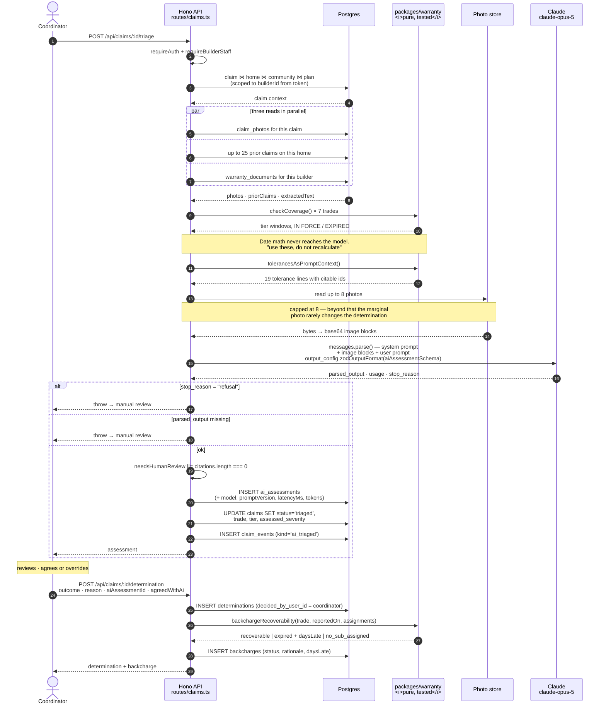

# AI triage

`apps/api/src/ai/triage.ts` — what the model is given, what it returns, and what
it is structurally prevented from doing.

One sentence, because it governs everything below:

> **The model classifies, cites, routes, and drafts. It does not decide.**

---

## 1. Grounded in two documents, not one

Most attempts at this ground the model in the warranty agreement alone. That is
not enough, and the gap is the reason claims get argued instead of determined.

A warranty agreement tells you **what is covered**. It does not tell you **when a
condition becomes a defect**. "One (1) year on workmanship and materials" has no
opinion about a hairline crack over a doorway. So a model given only the
agreement will either invent a threshold or hedge — and an invented threshold
that looks authoritative is worse than no answer, because a coordinator will act
on it.

Triage is therefore grounded in two sources:

**1. The builder's own warranty agreement.** `warranty_documents.extracted_text`
for the tenant, passed verbatim. The seeded Sandoval Homes document is a
realistic instance: §2.1 term structure, §3.0 exclusions (a–f), §4.0 the 24-hour
emergency obligation, §5.0 the Texas Ch. 27 sixty-day notice window, §6.0
transfer on resale. When no document is on file, the prompt says so explicitly
and instructs the model to note the absence and set `needsHumanReview`.

**2. A performance tolerance table.** `packages/warranty/src/tolerances.ts`,
injected by `tolerancesAsPromptContext()` as one line per entry with a stable id
the model cites back:

```
- drywall.crack (drywall): Cracks in drywall walls or ceilings — defect when
  Wider than 1/8". Note: Hairline cracks from lumber shrinkage are expected in
  year one. Standard practice is a single repair at the 11-month visit rather
  than repeated trips.
- windows_doors.water_infiltration (windows_doors) [ZERO TOLERANCE]: Water
  entering around a window or door — defect when Any infiltration is a defect.
  Note: No tolerance. Escalate — consequential damage compounds quickly.
```

Nineteen entries across thirteen trades. Four carry `[ZERO TOLERANCE]` —
`windows_doors.water_infiltration`, `roofing.leak`, `plumbing.leak`,
`electrical.outlet_dead` — meaning any occurrence is a defect with no measurement
to argue about.

This is what turns *"here's a photo of a crack"* into a defensible determination
rather than an opinion.

> ### ⚠️ Licensing caveat — read before shipping
>
> The **NAHB Residential Construction Performance Guidelines** is the de facto
> industry standard here, and it is **copyrighted**. The values in
> `tolerances.ts` are widely-cited approximations included as a **structural
> placeholder** so the engine and the prompt have something real to reason
> against during development.
>
> Before relying on this commercially you must license the NAHB guidelines, adopt
> the builder's own published performance standard, or use an applicable state
> standard (California's Civ. Code §896 prescriptive standards, for instance, are
> statutory rather than proprietary).
>
> The module is built so this is a data swap, not a refactor: every consumer
> reads through `findTolerance()`, `tolerancesForTrade()`, and
> `tolerancesAsPromptContext()`. Replace the `TOLERANCES` array wholesale without
> touching a call site.

---

## 2. The three-gate instruction

The system prompt makes the coordinator's mental model explicit, because
conflating these is the most common error in the domain:

> Three separate questions have to pass before a claim is covered. Keep them
> distinct.
>
> 1. Is the observed condition a defect at all, or is it within normal
>    construction tolerance?
> 2. Which warranty tier does the trade fall under, and is that tier still in
>    force on the claim date? **You are given the computed answer; do not
>    recalculate it.**
> 3. Do the builder's own warranty terms cover or exclude this specific
>    condition?

Gate 2 is not left to the model. `buildUserPrompt()` runs `checkCoverage()` for
seven common trades and pastes the verdicts in as fact:

```
## Coverage windows, already computed — use these, do not recalculate

- drywall (workmanship tier): IN FORCE — workmanship coverage runs through
  2026-10-03 (61 days remaining).
- plumbing (systems tier): IN FORCE — systems coverage runs through 2027-10-03
  (426 days remaining).
- ...
```

Date arithmetic that decides who pays for a repair belongs in tested code, not in
a language model. `clocks.test.ts` and `dates.ts` exist so that arithmetic is
provably correct; handing the result to the model removes an entire class of
plausible-looking error.

---

## 3. What the model is asked to do

| Task | Output field | Notes |
| --- | --- | --- |
| Classify the trade | `trade` | One of 22 `TRADES` — routes the work to the right sub |
| Assign the tier | `tier` | `workmanship` / `systems` / `structural` |
| Assess severity | `severity` | May differ from the homeowner's `reportedSeverity` |
| Flag emergencies | `isEmergency` | Independent of coverage — see below |
| Describe what is visible | `observedCondition` | "Stated factually", max 1000 chars |
| Match clause and tolerance | `citations[]` | `{ source, reference, quote }` |
| Run the tolerance comparison | `toleranceCheck` | `{ applies, standard, threshold, estimatedMeasurement, withinTolerance }` |
| Propose an outcome | `proposedOutcome` | One of the 8 `DETERMINATION_OUTCOMES` |
| Detect duplicates | `possibleDuplicateOfClaimIds[]` | Against up to 25 prior claims on the same home |
| Recommend an action | `recommendedNextStep` | What the coordinator should do next |
| Report its own uncertainty | `confidence`, `needsHumanReview` | See §5 |

Enforced by `aiAssessmentSchema` (zod) passed as `zodOutputFormat(...)` to
`client.messages.parse()`. The response is structurally guaranteed to be a valid
`AiAssessment` or to fail loudly — there is no free-text parsing anywhere in the
path.

### The behavioral rules, and why each exists

Verbatim from `SYSTEM_PROMPT`, with the reasoning:

- **"Describe only what is actually visible in the photos. If the photos are
  unclear, blurry, or don't show the described condition, say so and set
  needsHumanReview."** — A homeowner photographing a ceiling stain at night with
  a phone flash is the normal case, not the exception.

- **"Estimate measurements only when there is a scale reference in the photo. If
  there isn't, leave estimatedMeasurement null rather than guessing — a
  fabricated measurement produces a defensible-looking but wrong
  determination."** — This is the single most dangerous failure mode. `1/8"` is
  the boundary between "expected shrinkage" and "covered defect" for drywall, and
  nobody can eyeball that from a photo with no coin, tape, or fingertip in frame.
  A confident wrong number gets copied into a denial letter.

- **"Cite the clause or tolerance you relied on. An uncited proposal is treated
  as low confidence regardless of the number you report."** — Enforced in code,
  not just requested. See §5.

- **"Flag emergencies aggressively. Active water intrusion, sewage, no heat or
  cooling in extreme weather, no electricity, and gas odor are emergencies
  regardless of coverage status — consequential damage compounds fast and the
  response obligation is separate from the coverage question."** — This mirrors
  §4.0 of the warranty document: *"Emergency response does not itself establish
  coverage."* Roll the truck, argue later. A $400 supply-line defect becomes a
  $40,000 mold claim while someone debates coverage.

- **"Route appliances and equipment carrying their own manufacturer warranty to
  manufacturer_warranty, even when the builder installed them."** — §3.0(d) of
  the agreement. Homeowners consistently file these with the builder.

- **"Watch for homeowner maintenance: HVAC filters, caulk and grout in wet areas,
  grading altered after closing, and landscape watering."** — §3.0(b). Note the
  seeded HVAC claim (`WC-1002`) includes *"We changed the filter last month"* —
  the homeowner pre-empting exactly this, and a good test of whether the model
  reads it.

- **"Check the prior claims list for duplicates. Same room plus same trade plus a
  similar description on the same home usually means a repeat visit for
  unresolved work, not a new claim — that distinction changes who pays and
  whether the original sub is back on the hook."** — A second trip for the same
  defect is a warranty *failure*, not a new claim, and the sub who did the failed
  repair may owe it regardless of clock position.

- **"Storm, impact, and accidental damage are insurance matters, not warranty."**
  — §3.0(e).

- **"Set needsHumanReview whenever you are genuinely uncertain. A low-confidence
  flag costs a coordinator thirty seconds; a confident wrong answer costs a
  lawsuit."** — The explicit statement of the asymmetry the whole design rests
  on.

---

## 4. What the model does not do

It **does not issue determinations.** There is no code path from an
`ai_assessments` row to a homeowner-visible outcome. Concretely:

| Guard | Where |
| --- | --- |
| Assessments write to `ai_assessments`, never to `determinations` | `POST /api/claims/:id/triage` |
| `determinations.decided_by_user_id` is `NOT NULL` and FK-restricted to a real user | `schema.ts` |
| Triage sets `claims.status = 'triaged'`, never `approved` / `denied` / `referred` | `routes/claims.ts` |
| Homeowners receive `assessments: []` from the claim detail endpoint | `GET /api/claims/:claimId` |
| Only builder staff can invoke triage at all | `requireBuilderStaff` |

It also does not compute coverage windows (given to it), does not touch the
schedule, does not contact anyone, and does not generate statutory notices.

### Why human-in-the-loop is not optional here

**Liability.** A coverage denial is an adverse decision against a consumer on a
transaction that is, for most people, the largest of their life. Depositions in
construction-defect litigation reconstruct exactly who decided what and on what
basis. "The system determined it was within tolerance" invites the follow-up
question about who validated the system, what its error rate is, and whether the
homeowner was told a machine denied them — none of which have good answers.
A named coordinator with a written reason has one.

**Consumer protection.** Several states regulate unfair or deceptive practices in
home warranty administration, and the right-to-cure statutes in
[`DOMAIN.md`](./DOMAIN.md) §4 presuppose a builder who *inspects* and *responds*.
A response generated without any human review is a poor fit for a statutory
scheme built around the builder's opportunity to actually look at the defect.
The distinction is not academic: statutory compliance is often what preserves the
builder's procedural position in litigation.

**Accuracy.** The load-bearing inputs are photographs taken by untrained people
in bad light. Vision models are good at "this is a drywall crack" and unreliable
at "this crack is 3/16 inches wide", and that second judgment is exactly where the
coverage boundary sits.

**Trust.** A homeowner who receives an instant automated denial escalates. A
homeowner who receives a decision with a named person, a quoted clause, and a
stated tolerance mostly does not, even when the answer is no.

---

## 5. The uncited-proposal rule

The prompt asks for citations. The code does not rely on the prompt:

```ts
assessment: {
  ...assessment,
  needsHumanReview: assessment.needsHumanReview || assessment.citations.length === 0,
},
```

Comment in the source: *"An uncited proposal is not trustworthy no matter what
confidence the model reports, so the flag is forced here rather than left to the
prompt."*

Two reasons this belongs in code:

1. **Prompt instructions are requests; code is a guarantee.** A model that
   reports `confidence: 0.94` with an empty `citations` array has produced an
   assertion with no traceable basis, and no prompt wording makes that reliable.
2. **It makes the failure mode visible rather than silent.** An uncited
   assessment still gets stored and still gets shown to the coordinator — with
   the review flag raised. Nothing is discarded; the confidence signal is simply
   not trusted.

`confidence` is a self-report and is treated as one. `needsHumanReview` is the
operational field, it defaults to `true` in the zod schema and in the column
default, and it can only ever be forced *up* by this rule.

---

## 6. The request path



### Notable properties of that path

**Triage is re-runnable.** Nothing is idempotent-locked; `ai_assessments` is a
history keyed by `claim_id` and ordered by `created_at`. Re-running after adding
photos, or after a prompt change, produces a new row rather than mutating the old
one. Comparing them is how you evaluate a prompt version.

**Photos are capped at eight.** Explicit reasoning in the source: beyond that the
marginal photo rarely changes the determination and the token cost is real. A
coordinator can request more.

**Refusals are handled as a routing decision, not a crash.** `stop_reason ===
"refusal"` produces an error naming the safety category and routes to manual
review.

**Failure is never the homeowner's problem.** `TriageUnavailableError` (no
`ANTHROPIC_API_KEY`) returns 503 from the triage endpoint alone. The claim was
created by a different endpoint and stands regardless. `/health` reports
`triage: "disabled (no ANTHROPIC_API_KEY)"` so the degraded state is observable
rather than mysterious.

---

## 7. Every coordinator action is labeled data

The split between `ai_assessments` and `determinations` is what makes evaluation
free. `createDeterminationSchema` carries two fields whose only purpose is
measurement:

```ts
aiAssessmentId: z.string().uuid().nullable().default(null),
agreedWithAi:   z.boolean().nullable().default(null),
```

Which means agreement rate is a query, not an annotation project:

```sql
select a.prompt_version,
       a.proposed_outcome,
       d.outcome                     as human_outcome,
       count(*)                      as n,
       avg(a.confidence)             as avg_confidence,
       avg((d.agreed_with_ai)::int)  as agreement_rate
from determinations d
join ai_assessments a on a.id = d.ai_assessment_id
group by 1, 2, 3
order by n desc;
```

Because the assessment row stores `model`, `prompt_version`, `latency_ms`,
`input_tokens`, and `output_tokens`, that breaks down by prompt version and by
model, which is the whole point of `PROMPT_VERSION` being a bumped string
(`"2026-08-02.1"`) rather than an implicit thing. The comment on the constant:
*"Bump when the prompt changes so assessments stay comparable over time."*

The interesting queries are the disagreements:

| Signal | What it tells you |
| --- | --- |
| High `confidence`, `agreed_with_ai = false` | Miscalibration — the prompt is wrong somewhere specific |
| `proposed_outcome = 'covered'` → human `not_covered_tolerance` | The tolerance table is being under-applied |
| `proposed_outcome = 'not_covered_*'` → human `covered` | Over-denial. The expensive direction, and the one to watch |
| `needs_human_review = true` with high agreement | The uncertainty flag is firing too eagerly |
| Empty `citations` clustered on one trade | Missing tolerance coverage for that trade |

The last one is a direct product signal: it says which tolerance entries to write
next.

---

## 8. Model and configuration

| Setting | Value | Where |
| --- | --- | --- |
| Model | `claude-opus-5` | `MODEL` in `triage.ts` |
| Prompt version | `2026-08-02.1` | `PROMPT_VERSION` |
| Max output tokens | 16000 | `messages.parse()` call |
| Structured output | `zodOutputFormat(aiAssessmentSchema)` | `@anthropic-ai/sdk/helpers/zod` |
| Photo cap | 8, base64-inlined | `buildPhotoBlocks()` |
| API key | `ANTHROPIC_API_KEY`, **optional** | `env.ts`; `aiEnabled` boolean |
| SDK | `@anthropic-ai/sdk` ^0.115.0 | `apps/api/package.json` |

Message construction puts **images first, then the text prompt** — the model sees
the evidence before it reads the homeowner's characterization of it.

---

## Related

- [`DOMAIN.md`](./DOMAIN.md) — what a tolerance is and why it decides the case
- [`ARCHITECTURE.md`](./ARCHITECTURE.md) — where assessments sit in the data model
- [`ROADMAP.md`](./ROADMAP.md) — clause extraction, notice drafting, and what else is queued
