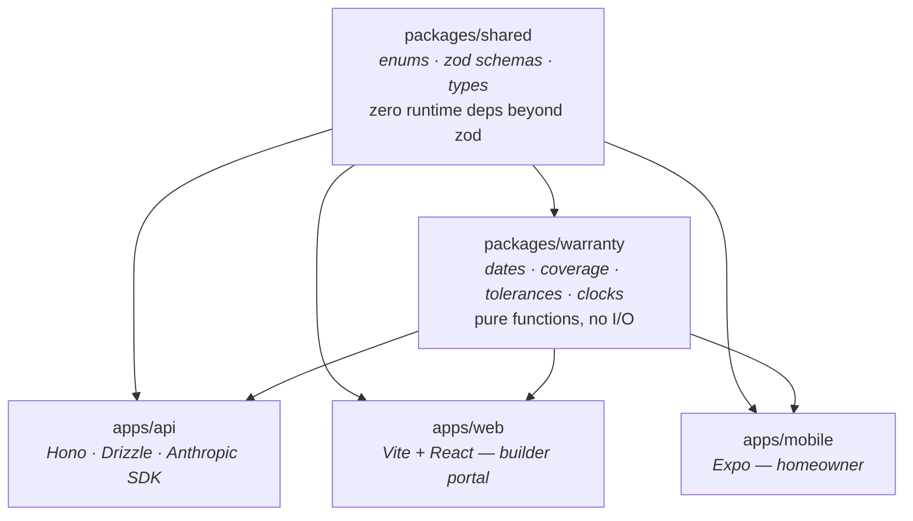
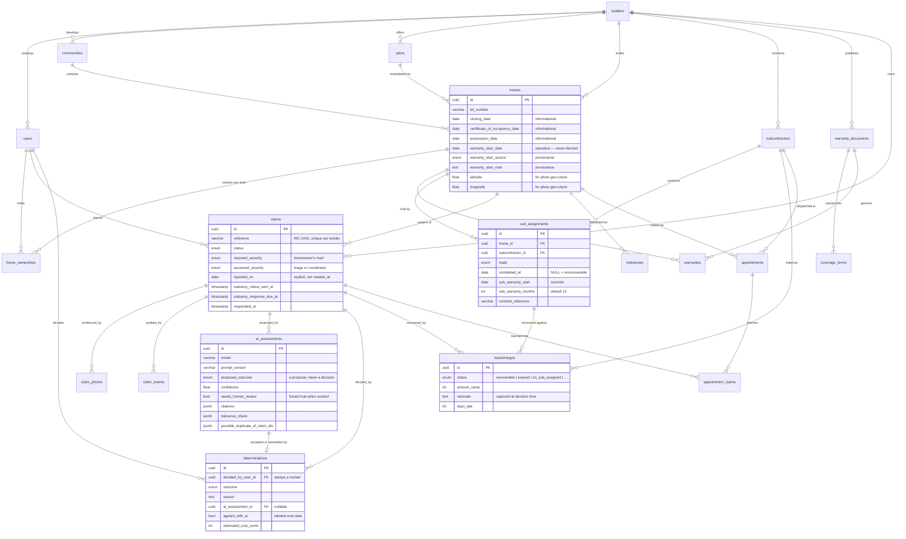
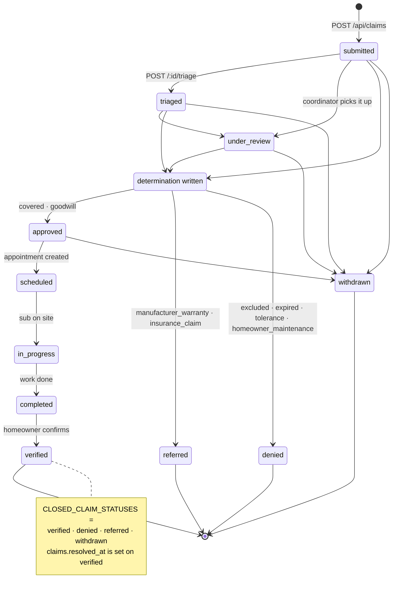

# Architecture

How the domain in [`DOMAIN.md`](./DOMAIN.md) is modeled, computed, and served.

---

## 1. The monorepo

pnpm workspaces, one TypeScript codebase, Node 22+, Postgres 17.

```
warranted/
├── apps/
│   ├── mobile/     Expo (React Native) — iOS + Android, homeowner-facing
│   ├── web/        Vite + React — builder portal
│   └── api/        Hono + TypeScript, Postgres via Drizzle
└── packages/
    ├── shared/     zod schemas, enums, shared types
    └── warranty/   coverage rules + tolerance table + clock math
```

> **Current state.** All five workspaces are implemented. What is thin is
> coverage, not structure: there are no tests outside `packages/warranty`, and
> several write paths exist only as zod schemas with no route behind them. See
> [`ROADMAP.md`](./ROADMAP.md).

### Dependency direction



Both clients depend on `packages/shared` **and** `packages/warranty`. The second
one is the interesting dependency: `tierCoverage` and `milestoneSchedule` are
pure functions with no I/O, so a countdown can be recomputed on-device between
fetches rather than round-tripping for a number that only changes at midnight.

Arrows only point one way. `packages/warranty` imports from `packages/shared` and
nothing else — it has no database access, no network calls, and no clock of its
own (`asOf` is always a parameter). That is what makes the exposure math
testable with fixed dates and reusable on a client without shipping a database
driver to a phone.

`packages/shared` is the vocabulary. Its enums are the *single* definition of
trades, tiers, statuses, severities, outcomes, and roles: they generate the zod
validators, they are re-exported into the Postgres enums in `schema.ts`, and
they are injected into the AI triage prompt. A claim shape cannot drift between
the three surfaces because there is only one place to change it.

### The clients

**`apps/web` — the builder portal.** Vite 6 + React 19, React Router 7, TanStack
Query 5, hand-written CSS. Five screens, mapping one-to-one onto the builder-side
endpoints:

| Route | Page | Backed by |
| --- | --- | --- |
| `/exposure` | The alert board — the landing route | `GET /api/builder/exposure` |
| `/claims` · `/claims/:claimId` | Queue and claim detail: photos, event history, AI proposal with citations, determination form | `GET /api/claims`, `POST /:id/triage`, `POST /:id/determination` |
| `/subcontractors` | Sub scorecard | `GET /api/builder/subcontractors/scorecard` |
| `/patterns` | Plan-level defect clustering | `GET /api/builder/patterns` |
| `/login` | JWT into `localStorage` | `POST /api/auth/login` |

Two details worth noting. The Vite dev server **proxies `/api` and `/uploads` to
`localhost:3001`**, so the browser stays on one origin — no CORS in development
and no absolute API URL compiled into the client. And a `401` from any request
clears the stored token in the fetch wrapper, so an expired session redirects to
login instead of stranding the user on a broken screen.

The exposure page is the one that matters: it renders the sorted alert list and
the per-lot breakdown, and its primary action is scheduling the 11-month review
(`POST /api/homes/:homeId/milestones/eleven_month/schedule`) — the one move that
converts a critical alert into a warning.

**`apps/mobile` — the homeowner app.** Expo 57 / React Native 0.86 with
expo-router, one codebase for iOS and Android. Root stack plus a two-tab shell
(My home · Claims), `claim/new` as a modal and `claim/[id]` as a detail screen,
tokens on `AsyncStorage`.

The **My home** screen leads with the countdown rather than burying it, and
escalates the 11-month review inside 120 days — warning styling, then critical
inside 45. It is the homeowner-side mirror of the builder's exposure alert, fed
by the same `milestoneSchedule` math.

**Claim capture is the evidentiary path**, and it is where the client does real
work rather than just rendering: `expo-image-picker` is called with
`exif: true`, and the uploader prefers the photo's own `GPSLatitude` /
`GPSLongitude`, falling back to `expo-location` only when the image carries no
geotag. `DateTimeOriginal` (or `DateTime`) becomes `exif_taken_at`. Location
permission failure is caught and ignored on purpose — a claim without
coordinates still stands, and `geo_verified` simply resolves to `null`. See §5.

### Why the rules engine is its own package

`checkCoverage`, `analyzeExposure`, and `backchargeRecoverability` decide who
pays for a repair. Three properties follow from that:

1. **Pure.** No I/O. Every input, including "now", is an argument. `clocks.test.ts`
   pins exact dates — 188 exposure days, 83 days late — and those assertions are
   meaningless if the functions can read a clock.
2. **Day-precision, UTC-anchored.** `dates.ts` operates on `YYYY-MM-DD` strings
   parsed at **UTC noon**. The bug it prevents is real: `new Date("2026-03-14")`
   in any US timezone lands on the 13th, and an off-by-one on a warranty boundary
   is a dollar error, not a display error. A test guards it directly.
3. **Calendar months, not 365 days.** `addMonths` clamps to the end of a short
   month — Jan 31 + 1 month = Feb 28, or Feb 29 in a leap year — because warranty
   terms read "twelve months from closing", not "365 days from closing".

---

## 2. The API

Hono on `@hono/node-server`, port 3001. Four route groups, all JSON, bearer-token
auth.

| Route | Method | Who | Purpose |
| --- | --- | --- | --- |
| `/health` | GET | public | Liveness; reports whether triage is enabled |
| `/api/auth/login` | POST | public | scrypt password check → JWT |
| `/api/auth/me` | GET | any | Session echo |
| `/api/homes` | GET | any | Portfolio (staff) or owned homes (homeowner), with live tier countdowns and milestones |
| `/api/homes/:homeId` | GET | scoped | One home + warranties + claims + ownership history |
| `/api/homes/:homeId/milestones/:kind/schedule` | POST | staff | The action on an 11-month alert |
| `/api/claims/photos` | POST | scoped | Upload + EXIF/geo verification, **before** the claim exists |
| `/api/claims` | POST | scoped | File a claim, attaching pre-uploaded photos |
| `/api/claims` | GET | any | Scoped list |
| `/api/claims/:claimId` | GET | scoped | Full claim with photos, events, assessments, determinations, backcharges |
| `/api/claims/:claimId/triage` | POST | staff | Run AI triage — always re-runnable |
| `/api/claims/:claimId/determination` | POST | staff | The human decision + backcharge computation |
| `/api/claims/:claimId/status` | POST | staff | Status transition with an audit note |
| `/api/builder/exposure` | GET | staff | **The alert board** |
| `/api/builder/subcontractors/scorecard` | GET | staff | Procurement leverage |
| `/api/builder/patterns` | GET | staff | Plan-level defect clustering |

### Auth and the tenant boundary

JWTs via `jose`; passwords via Node's built-in `scrypt` (no external hashing
dependency). Login verifies against a dummy hash when the email is unknown so
response timing does not reveal which addresses are registered.

Two middleware layers matter:

- `builderIdOf(c)` reads the tenant id **from the verified token**, never from a
  request body. Every builder-scoped query filters on it. Trusting a `builderId`
  in a payload would let one builder read another's lots by guessing a UUID.
- `canAccessHome(user, homeId)` is the row-level check. Builder staff see homes
  their company built. Homeowners see homes they own **or have owned** — a prior
  owner retains read access to claims they filed, which is required for resale to
  work at all.

`currentHomeIdsFor()` scopes a homeowner's app to homes where `ended_at IS NULL`.
Ownership is a history table, not a column, for the same reason.

---

## 3. The data model

Twenty tables, one migration (`drizzle/0000_charming_true_believers.sql`), ten
Postgres enums mirrored from `@warranted/shared` so the database enforces the
same vocabulary the TypeScript does.

### Tenancy

| Table | Notes |
| --- | --- |
| `builders` | The tenant boundary — everything cascades from here. Carries `state` (governs which right-to-cure statute applies) and `tier_months_override` jsonb for non-1-2-10 programs. |
| `users` | `role` is one of four. `builder_id` is **null for homeowners** — they belong to homes, not to a builder org. Email uniqueness is a `lower(email)` functional unique index. |

### Portfolio

| Table | Notes |
| --- | --- |
| `communities` | A subdivision. |
| `plans` | A floor plan + `elevation`. Homes reference it so a defect recurring across the same plan is detectable as a pattern rather than as N unrelated claims. |
| `homes` | The center of the model. Unique on `(community_id, lot_number)`. Carries `latitude`/`longitude` for photo geo-verification, all three candidate start dates, and the sourced `warranty_start_date` triple. Indexed on `warranty_start_date` because every countdown query sorts by it. |
| `home_ownerships` | Ownership as history, not a column. `is_original_owner` matters because structural coverage typically transfers on resale and workmanship typically does not. |

### Warranty terms

| Table | Notes |
| --- | --- |
| `warranty_documents` | The source PDF. `extracted_text` is what gets fed to triage as grounding. `home_id` is nullable — null means the builder's standard program rather than a lot-specific document. |
| `warranties` | One row per `(home, tier)`, unique. Holds `administrator` and `policy_number` for insurer-backed tiers, and `transfers_on_resale`. Indexed on `end_date` for expiry sweeps. |
| `coverage_terms` | Individual clauses parsed out of a document, with `page_number`. `is_coverage = false` marks exclusions. Exists so a determination can quote the specific term it relied on instead of gesturing at a whole PDF. |

### The second clock

| Table | Notes |
| --- | --- |
| `subcontractors` | Per builder. `default_warranty_months` and `insurance_expires_on` — lapsed COI is its own liability, surfaced alongside warranty risk on the scorecard. `onDelete: restrict` from assignments: you cannot delete a sub who has history. |
| `sub_assignments` | **The dual-clock record.** Who did what on which lot, and when their clock started. |

`sub_assignments` is where the thesis lives, so its column semantics are worth
stating precisely:

```
completed_at         date      -- when the sub finished. Starts their clock.
sub_warranty_start   date      -- explicit override when the contract says otherwise
sub_warranty_months  integer   -- default 12; plumbing/electrical/HVAC often 24
```

`subWindow()` resolves the start as `sub_warranty_start ?? completed_at`. It
**deliberately does not fall back to the home's warranty start**. Collapsing
those two would make every lot look fully covered and erase the entire product.
`completed_at = NULL` is not a benign gap — it is treated as full exposure.

### Claims

| Table | Notes |
| --- | --- |
| `claims` | `reference` (e.g. `WC-1042`) unique per builder. `reported_on` is a stored date, **not** read off `created_at`, because backdated paper claims get entered too and filing date drives every coverage question. `reported_severity` and `assessed_severity` are separate columns. Three right-to-cure timestamps: `statutory_notice_sent_at`, `statutory_response_due_at`, `responded_at`. |
| `claim_photos` | Evidence. See §5. `claim_id` is nullable so a photo can be uploaded before the claim exists. |
| `claim_events` | Append-only audit trail: `kind`, `from_status`, `to_status`, `actor_user_id`, freeform `metadata` jsonb. The bus-factor insurance. |
| `ai_assessments` | What the model proposed. |
| `determinations` | What a human decided. |

The last two are separate tables and that is the most important structural
decision in the schema. See §6.

### Scheduling and recovery

| Table | Notes |
| --- | --- |
| `milestones` | One row per `(home, kind)`, unique. Status drives whether the exposure board escalates. |
| `appointments` | `homeowner_confirmed` defaults false — an unconfirmed appointment is a wasted truck roll. |
| `appointment_claims` | Composite-PK join. Many-to-many **so batching several claims into one visit is expressible**, which is the main scheduling lever. |
| `backcharges` | `status` is a `BACKCHARGE_STATUS` computed at *determination* time, not invoice time. Stores the `rationale` string verbatim and `days_late` when expired. Indexed on `(subcontractor_id, status)` for the scorecard. |

### ER diagram



---

## 4. The claim lifecycle

```mermaid
flowchart TD
    A["Homeowner photographs the defect<br/><i>mobile app</i>"] --> B["POST /api/claims/photos<br/>multipart + EXIF metadata"]
    B --> B1{"Photo geotag vs.<br/>homes.latitude/longitude<br/>Haversine, 250 m"}
    B1 -->|within| B2["geo_verified = true"]
    B1 -->|outside| B3["geo_verified = false<br/><i>flagged, not rejected</i>"]
    B1 -->|no coords on either side| B4["geo_verified = null<br/><i>not checkable ≠ failed</i>"]
    B2 --> C
    B3 --> C
    B4 --> C

    C["POST /api/claims<br/>title · description · room · severity · photoIds"] --> D["claims.status = submitted<br/>reference WC-1042 assigned<br/>claim_events += submitted"]

    D --> E["POST /api/claims/:id/triage<br/><i>builder staff</i>"]
    E --> E1{"ANTHROPIC_API_KEY set?"}
    E1 -->|no| E2["503 triage_unavailable<br/><b>claim still stands</b>, awaits manual review"]
    E1 -->|yes| F["Model reads: photos · description ·<br/>precomputed coverage windows ·<br/>tolerance table · warranty document text ·<br/>prior claims on this home"]

    F --> G["ai_assessments row<br/>trade · tier · severity · isEmergency ·<br/>proposedOutcome · confidence · <b>citations</b> ·<br/>toleranceCheck · duplicate ids"]
    G --> G1{"citations empty?"}
    G1 -->|yes| G2["needsHumanReview forced true"]
    G1 -->|no| G3["needsHumanReview as reported"]
    G2 --> H
    G3 --> H["claims.status = triaged<br/>trade / tier / assessedSeverity written back"]

    H --> I["Coordinator reviews the proposal<br/><i>builder portal</i>"]
    I --> J["POST /api/claims/:id/determination<br/>outcome · reason · agreedWithAi · cost"]

    J --> K{"outcome"}
    K -->|covered · goodwill| L["status = approved"]
    K -->|manufacturer_warranty · insurance_claim| M["status = referred"]
    K -->|excluded · expired · tolerance · maintenance| N["status = denied"]

    L --> O["<b>backchargeRecoverability</b><br/>trade × reported_on × sub_assignments"]
    O --> P{"sub window on claim date"}
    P -->|open| Q["recoverable<br/><i>bill it while it's open</i>"]
    P -->|closed| R["expired + daysLate<br/><i>e.g. 83 days late</i>"]
    P -->|no completion date| S["no_sub_assigned<br/><i>unrecoverable</i>"]
    Q --> T
    R --> T
    S --> T["backcharges row written"]

    T --> U["Schedule — appointment,<br/>batched with other open claims on the lot"]
    U --> V["in_progress → completed"]
    V --> W["Homeowner confirms → verified<br/>claims.resolved_at set"]

    style E2 stroke-dasharray: 5 5
    style B3 stroke-dasharray: 5 5
```



Two details in there are deliberate and easy to miss.

**Photos upload before the claim exists.** `claim_photos.claim_id` is nullable and
gets backfilled by `POST /api/claims`. The reason is latency: the app starts
pushing a 4 MB photo the moment the homeowner takes it, while they are still
typing the description. By the time they hit submit the upload is done.

**A missing API key does not block filing.** `TriageUnavailableError` returns 503
from the triage endpoint only. The claim was already created and is sitting in
`submitted`. A homeowner must never be prevented from filing because an internal
service is down — the filing date is the legally significant act.

### Status transitions



`POST /api/claims/:id/status` currently accepts **any** `CLAIM_STATUS` from
builder staff — the diagram above describes intended flow, not an enforced state
machine. Every transition does write a `claim_events` row with `from_status` and
`to_status`, so the history is complete even where the guard rails are not. See
[`ROADMAP.md`](./ROADMAP.md).

---

## 5. Photos as evidence

Photo handling is designed around one question: *can this still be relied on in
eighteen months, when it is disputed?*

Three fields on `claim_photos` do the work, and all three are stored
**separately from `created_at`**:

```
exif_taken_at              timestamptz   from the image's own EXIF
latitude / longitude       double        from the image's own EXIF GPS
geo_verified               boolean NULL  three-state, see below
distance_from_home_meters  double        the actual computed number
```

On upload, `POST /api/claims/photos` computes great-circle distance (Haversine,
`EARTH_RADIUS_M = 6_371_000`) between the photo's coordinates and
`homes.latitude/longitude`, and compares against `GEO_TOLERANCE_M = 250` — loose
enough for GPS drift and a large lot, tight enough to catch a different address.

`geo_verified` is deliberately **nullable**, and the three states mean different
things:

| Value | Meaning |
| --- | --- |
| `true` | Photo coordinates within 250 m of the lot |
| `false` | Photo coordinates present, but somewhere else |
| `null` | Not checkable — the photo carried no geotag, or the lot has no coordinates |

Collapsing `null` into `false` would turn "we don't know" into an accusation, and
plenty of legitimate photos have location services disabled. **Nothing is
rejected on geo grounds.** The value is recorded and surfaced; a human decides
what it means.

What this buys, for nearly free: EXIF capture time kills *"I reported this back
in March"* when the image was taken last week, and the geotag kills *"you
photographed that at your old house"*. Two entire dispute classes, closed by two
columns.

Storage today is the local filesystem (`UPLOAD_DIR`, served by `serveStatic` at
`/uploads/*`). That is a development affordance and the code says so — claim
photos are evidence and should not live on an app server's disk. S3 or any
signed-URL store is on the roadmap.

---

## 6. Why the AI proposes rather than decides

`ai_assessments` and `determinations` are two tables, and no code path writes a
determination without a `decided_by_user_id` referencing a real user.

**The liability argument.** An automated coverage denial delivered to a consumer
with no human in the loop is a bad exhibit in a deposition and a
consumer-protection exposure in several states. "The computer said no" is not a
defense; it is the plaintiff's opening slide. A denial has to be a person's
decision, with that person's stated reason, attributable to them.

**The product argument.** The coordinator is not the bottleneck — scheduling is.
Adjudicating a claim takes two minutes; the value of triage is removing the
*research* (which trade, which clause, which tolerance, is this a duplicate, is
this an emergency), not removing the human. The flow is **AI proposes with
citations → coordinator approves in one tap.**

**The data argument.** Because the two are separate rows joined by
`determinations.ai_assessment_id` and flagged with `agreed_with_ai`, every single
coordinator action becomes **labeled evaluation data**. Agreement rate by trade,
by outcome, by `prompt_version` is a query, not an annotation project. That is
also why `ai_assessments` stores `model`, `prompt_version`, `latency_ms`,
`input_tokens`, and `output_tokens` — you cannot compare assessments over time
without knowing what produced them.

One consequence is enforced at the read layer: `GET /api/claims/:claimId` returns
`assessments: []` and `backcharges: []` when the caller is a homeowner. An
unreviewed machine opinion is not something to put in front of a customer, and
the backcharge status is between the builder and its sub.

Full detail in [`AI_TRIAGE.md`](./AI_TRIAGE.md).

---

## 7. The exposure board

`GET /api/builder/exposure` is the endpoint the product exists to serve. Its
shape:

1. Load every home for the tenant, with community and plan.
2. Load all `sub_assignments` for those homes in one query, joined to
   `subcontractors` for the display name.
3. Load the `eleven_month` milestone for each home.
4. Per lot, run `analyzeExposure({ warrantyStartDate, assignments, asOf })` —
   pure, no further I/O — then `exposureAlerts({ exposure, elevenMonthScheduled,
   lotLabel })`.
5. Sort alerts so the money is at the top: `critical` before `warning`, then
   soonest sub expiry, then largest exposure window.

The response carries three things: the flat sorted `alerts` array, a per-lot
`lots` array with the full `ExposureWindow[]` and `totalExposureDays`, and a
`summary` with counts — critical alerts, warning alerts, undocumented
assignments, and lots whose 11-month is due within 60 days and still unscheduled.

Three queries total, regardless of portfolio size. All the arithmetic happens in
`packages/warranty` on data already in memory, which is why it can be unit-tested
against fixed dates and why it will move to a client unchanged.

---

## 8. Conventions

- **ESM everywhere.** `"type": "module"`; relative imports inside `apps/api` carry
  the `.js` extension because that is what NodeNext resolution requires.
- **Workspace packages ship TypeScript source**, not builds — `main` points at
  `./src/index.ts`. No build step between packages during development.
- **Errors are a single envelope**: `{ error: { code, message, details? } }`,
  produced by `app.onError`. ZodErrors become `validation_failed` with a
  `flatten()` payload; everything else becomes `internal_error`, with the real
  message leaking only in development.
- **Env is validated at boot** by a zod schema in `env.ts`, which exits with a
  readable list of what is missing rather than failing at first use.
  `JWT_SECRET` must be ≥32 characters and the error tells you how to generate
  one.
- **Money is integer cents** (`estimated_cost_cents`, `amount_cents`). No floats.
- **Dates that participate in warranty math are `date`**, not `timestamp`, and
  cross the boundary as `YYYY-MM-DD` strings. Timestamps are reserved for events
  (`created_at`, `statutory_notice_sent_at`, `resolved_at`).
- **Enums are defined once** in `packages/shared/src/enums.ts` and mirrored into
  Postgres. Adding a trade means editing one array and generating a migration.

---

## Related

- [`DOMAIN.md`](./DOMAIN.md) — what any of this means
- [`AI_TRIAGE.md`](./AI_TRIAGE.md) — the triage contract in detail
- [`ROADMAP.md`](./ROADMAP.md) — what is built and what is not
