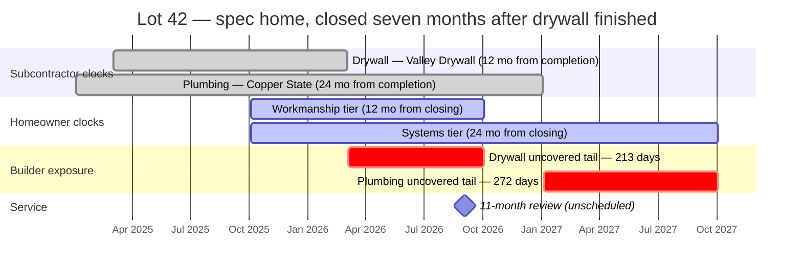
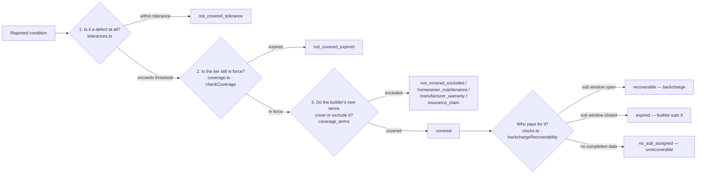

# The domain

What a new-home warranty actually is, who owes what to whom, and where the money
leaks. This is the document to read before any of the others — the data model and
the AI prompt are both downstream of it.

Written for an engineer who has never administered a warranty, or an operations
lead who has and wants to know what the software believes.

---

## 1. How US new-home warranties are structured

A production or regional homebuilder in the US issues an express limited warranty
at closing. It is not one warranty — it is three, running concurrently from the
same start date with different durations. The shorthand is **1-2-10**.

| Tier | Code value | Months | Covers | Who claims against it |
| --- | --- | --- | --- | --- |
| Workmanship & materials | `workmanship` | 12 | Drywall, paint, trim, doors, flooring, tile, cabinets, countertops, roofing installation, grading | Almost everyone |
| Systems | `systems` | 24 | Plumbing, electrical, HVAC, mechanical distribution | Some |
| Major structural | `structural` | 120 | Load-bearing failure only — foundation, framing, roof structure | Very few, but catastrophic |

These live in `packages/shared/src/enums.ts` as `WARRANTY_TIERS` and
`DEFAULT_TIER_MONTHS`, and are enforced as a Postgres enum. A builder running a
non-standard program (2-5-10 is the common variant) overrides the durations per
builder via `builders.tier_months_override`; the resolution logic is
`resolveTierMonths()` in `packages/warranty/src/coverage.ts`.

The tier a defect falls under is normally implied by the trade that did the work.
That mapping is `TRADE_DEFAULT_TIER`:

```
structural  → concrete, framing
systems     → plumbing, electrical, hvac
workmanship → everything else (22 trades total)
```

It is a default, not a rule. A warranty clause can assign a specific condition to
a specific tier, which is why `checkCoverage()` accepts a `tierOverride`.

### Third-party administrators

The 10-year structural tier is usually **insurance-backed and administered by a
third party** rather than carried by the builder directly. The dominant names:

- **2-10 Home Buyers Warranty** (HBW) — the largest
- **PWSC** (Professional Warranty Service Corporation)
- **RWC** (Residential Warranty Company)
- **StrucSure Home Warranty**

This matters operationally. When a claim is structural, the builder is often not
the payer or even the adjudicator — the administrator is, under its own claim
procedure and often a mandatory arbitration clause. The model records this on
`warranties.administrator` and `warranties.policy_number` per tier, so a
structural claim can be routed out of the builder's queue rather than sitting in
it. The seed sets `2-10 Home Buyers Warranty` on the structural tier only; the
workmanship and systems tiers are self-administered by Sandoval Homes.

### The three service touchpoints

The industry service ritual is fixed, and every builder runs some version of it.
`MILESTONE_KINDS` and `MILESTONE_OFFSET_DAYS` encode it:

| Milestone | Offset from warranty start | What it is |
| --- | --- | --- |
| `orientation` | day 0 | The blue-tape walkthrough at or just before closing. Buyer and superintendent walk the house tagging cosmetic defects with painter's tape. Produces the punch list. |
| `thirty_day` | day 30 | Early settling and anything missed at orientation. |
| `eleven_month` | **day 334** | The one that matters. |

**Why 334 days and not 365.** The 11-month review exists because it is the last
practical chance to file against the workmanship tier — the largest and
most-claimed bucket. Scheduling it *at* twelve months is useless: the visit
happens, defects are found, and the coverage has already lapsed by the time
anyone acts. Day 334 leaves roughly 31 days of runway to inspect, file, schedule,
and complete. `clocks.test.ts` asserts exactly this:

```ts
const schedule = milestoneSchedule("2026-03-01", "2026-03-01");
// eleven_month dueDate === "2027-01-29"
expect(daysBetween(elevenMonth.dueDate, "2027-03-01")).toBeGreaterThan(30);
```

The `ScheduledMilestone` type carries `isLastChance: boolean`, true only for
`eleven_month`. It is not decoration — it is the flag the homeowner app and the
builder alert board both key off.

---

## 2. The clock mismatch

This is the thesis. Everything else in the repo is scaffolding around it.

### Two warranties, two start dates

There are two warranties covering the same physical work, and they do not start
on the same day.

1. **The builder warrants to the homeowner**, starting at **closing**.
2. **Each subcontractor warrants to the builder**, starting at **that sub's own
   completion date** — when they finished their scope and left the site.

On a build-to-order home sold before construction, these are close enough that
nobody notices. On a **spec home** — built on inventory, sold later — or on a
slow-selling phase, the drywall sub can finish in March on a house that does not
close until October. The sub's twelve months are more than half gone before the
homeowner's twelve months begin.

**The overlap is protected. The tail is not.** Any workmanship claim landing
after the sub's window closes but inside the homeowner's is cash out of the
builder's pocket for work someone else owes.

```
                  Lot 42 — a spec home. Two clocks, one bill.

   2025-03-03                                    2026-03-03
   drywall sub                                   sub warranty ends
   completes                                     │
   │                                             │
   ├──────────────  sub: 12 months  ─────────────┤
   │                                             │
   │              2025-10-03                     │                   2026-10-03
   │              closing                        │                   workmanship ends
   │              │                              │                   │
   │              ├──────────  homeowner: 12 months  ─────────────────┤
   │              │                              │                   │
   └──────────────┼──────────────────────────────┼───────────────────┘
                  │                              │
                  │  ✓ COVERED BY BOTH           │ ███ EXPOSURE: 213 DAYS ███
                  │    151 days                  │  builder pays, nobody to bill
                  │    backcharge available      │  backcharge = expired
                  └──────────────────────────────┴───────────────────┐
                                                                     │
                                        11-month review due 2026-09-02
                                        — 183 days AFTER the sub clock closed
```

The last line is the operational sting. The service visit designed to *find*
workmanship defects is scheduled six months after the only party who could be
billed for them stopped being liable.

### The same thing as a gantt



Note the plumbing bar. A 24-month sub warranty against a 24-month systems tier
still leaves a 272-day tail, because the sub's two years started nine months
before closing. Longer sub warranties reduce exposure; they do not eliminate it.
Only a sub warranty that runs from *closing* does that, and subs do not sign
those.

### The worked example, verified by tests

`packages/warranty/src/clocks.test.ts` pins the arithmetic with a fixed fixture
so the numbers below are not illustrative — they are asserted:

```ts
const WARRANTY_START = "2026-09-15";           // closing
completedAt:      "2026-03-10"                 // drywall, six months earlier
subWarrantyMonths: 12
```

| Quantity | Value | Source |
| --- | --- | --- |
| Sub coverage ends | `2027-03-10` | `addMonths(completedAt, 12)` |
| Builder coverage ends | `2027-09-15` | `addMonths(warrantyStart, 12)` |
| Exposure starts | `2027-03-11` | day after the sub lapses |
| **Exposure window** | **188 days** | `expect(drywall.exposureDays).toBe(188)` |

And the consequence at claim time, from the same file:

| Claim filed | `backchargeRecoverability` | Detail |
| --- | --- | --- |
| `2027-01-15` | `recoverable` | Sub window open — bill it |
| `2027-06-01` | `expired` | **83 days late.** `expect(result.daysLate).toBe(83)` |

Eighty-three days is the entire difference between a backcharge and a write-off,
and today it is discovered at invoice time — months after the work is done and
the sub has moved on. `backchargeRecoverability()` answers it at *determination*
time instead, while the coordinator still has options.

### The third case: no clock at all

A `sub_assignments` row with `completed_at = NULL` is not missing data. It is the
bus-factor failure made durable: the builder cannot establish when the sub's
window opened, therefore cannot prove it was open, therefore cannot backcharge at
all. `analyzeExposure()` treats it as **full exposure** — the entire builder
window, start to finish — and `exposureAlerts()` raises it as `critical`
unconditionally.

For a framing sub (structural tier) that is 3,652 days of unrecoverable
liability from a single blank field. The test asserts `> 3600`.

### The alert the product exists to send

`exposureAlerts()` produces exactly three shapes, in priority order:

| Condition | Severity | Message shape |
| --- | --- | --- |
| `unknown` — no completion date | **critical** | *"no completion date on record for framing. Warranty work on this trade cannot be backcharged — the full 3652-day builder window is unrecoverable."* |
| Sub expiring within 45 days **and** exposure exists **and** 11-month unscheduled | **critical** | *"Valley Drywall (drywall) warranty expires in 21 days, leaving 213 days where you carry this trade alone — and the 11-month review is not yet scheduled. Inspect before the sub clock closes."* |
| Same, but 11-month is scheduled | warning | Same, without the escalation clause |
| Already inside the exposure window | warning | *"drywall sub warranty closed 2026-03-03. Claims through 2026-10-03 are on the builder."* |

The conjunction in row two is the whole product. A sub warranty about to lapse is
only interesting *because* the homeowner's clock keeps running afterward; the
11-month review being unscheduled is what turns a known risk into an unfound
defect. `SUB_EXPIRY_ALERT_DAYS = 45` is the threshold — long enough to get a
superintendent into the house and a sub back on site.

### The seeded portfolio

`apps/api/src/db/seed.ts` builds Sandoval Homes (Round Rock, TX), community Cedar
Hollow, three lots, chosen so the three cases are visible on first load. Dates
are anchored to the seed run date; the figures below are from a run on
**2026-08-03**.

| Lot | Plan | Warranty start | Situation | Total exposure |
| --- | --- | --- | --- | --- |
| **42** | Aspen B | 10 months ago | Spec home. CO 16 months ago, closed 10 months ago. Four trades, all finished 17–19 months ago. | **939 days** |
| **7** | Aspen B | 9 months ago | Healthy build-to-order. CO and closing in the same week. | 90 days |
| **15** | Birch A | 6 months ago | Framing sub has no completion date. | **3,713 days** |

Lot 42 in detail:

| Trade | Sub | Completed | Sub warranty ends | Builder tier ends | Exposure |
| --- | --- | --- | --- | --- | --- |
| drywall | Valley Drywall & Paint | 2025-03-03 | 2026-03-03 | 2026-10-03 (workmanship) | 213 d — *currently exposed* |
| hvac | Lone Star Mechanical | 2025-03-03 | 2027-03-03 | 2027-10-03 (systems) | 213 d |
| electrical | Brightline Electric | 2025-02-03 | 2027-02-03 | 2027-10-03 (systems) | 241 d |
| plumbing | Copper State Plumbing | 2025-01-03 | 2027-01-03 | 2027-10-03 (systems) | 272 d |

Lot 42's 11-month review is deliberately left `pending` in the seed. That is what
escalates its alerts to critical, and it is the state most real lots are in.

Two other details are planted in the seed because they are real: Lone Star
Mechanical's certificate of insurance **lapsed a month ago**
(`insurance_expires_on` in the past), and Lot 42 carries two open claims — a
drywall crack and upstairs bedrooms running 8°F warm — both filed on the seed
date, both untriaged.

---

## 3. Where the homeowner loses

The builder's exposure is not that homeowners file too much. In practice they
file too little, too late, and about the wrong things.

**The warranty is a PDF in a closing binder.** It was handed over on a day the
buyer signed roughly eighty other documents. Nobody has read it. Nobody can find
it in month nine. `warranty_documents.file_url` and `extracted_text` exist so the
document is retrievable and quotable, not just archived.

**Nobody reminds them.** There is no countdown anywhere in the buyer's life. The
11-month review is the builder's ritual, not the homeowner's, and if the builder
does not call, it does not happen. `GET /api/homes` returns
`tiers[].daysRemaining` and `nextMilestone` at the top of the payload rather than
buried in a documents tab, because the countdown *is* the product for the
homeowner.

**They cannot tell a defect from normal first-year settling.** A new house dries
out, and lumber shrinks. Hairline drywall cracks, nail pops, hardwood gapping,
sticking doors, and shrinkage cracks in concrete are all *expected*. Without a
performance standard, "there's a crack in my drywall" has no answer. With one,
the answer is "hairline cracks under ⅛" are expected first-year shrinkage,
addressed once at the 11-month visit." The consequence of not having that answer
runs both directions: homeowners file excluded items and lose trust when denied,
or stay silent about the real ones. `packages/warranty/src/tolerances.ts` is that
table.

**No timestamped record.** Problems get reported by text message to whichever
superintendent's number the buyer still has. When it is disputed at month
thirteen — "I told you about this in March" — there is nothing to point at.
Every claim writes an append-only `claim_events` row, and every photo stores its
**EXIF capture time and GPS coordinates separately from upload time**. That kills
two whole dispute classes ("you took that photo at your old house", "you reported
that last week, not last year") for nearly free.

**Appliance and manufacturer passthrough.** The dishwasher, range, water heater,
garage door opener, and HVAC equipment carry the *manufacturer's* warranty,
assigned to the homeowner at closing — not the builder's. Homeowners do not know
this and file with the builder; builders bounce it back with no routing help. The
`appliances` trade exists for exactly this, the `manufacturer_warranty`
determination outcome routes it, and the seeded warranty document's §3.0(d) is
the clause that says so.

**Maintenance obligations that void coverage.** Buried in the exclusions:
replacing HVAC filters, re-caulking tubs and showers, re-sealing grout in wet
areas, maintaining original grading and drainage, and watering the foundation in
expansive-clay markets. Failing these does not just leave a condition uncovered —
it can void coverage on the damage that follows. The `homeowner_maintenance`
outcome exists so this is a recorded determination with a reason, not a phone
call. Note the trap in `landscape_grading.drainage`: coverage lapses once the
homeowner alters grade, adds hardscape, or installs a pool, which is why the
tolerance note says to **document the original grade at closing**.

---

## 4. Where the builder loses

**The bus factor.** One warranty coordinator holds the lot→sub mapping, the side
deals, the "we already fixed that once" history, and the informal understanding
of which sub owes what. It is in their head and a spreadsheet on their desktop.
When they leave, the company loses the ability to prove who did the work — and
therefore to backcharge at all. `sub_assignments` is the trade-to-lot ledger that
does not walk out the door, and `claim_events` is the append-only history of who
did what.

**No trade-to-lot ledger.** Even where sub contracts exist, they live in
accounting as purchase orders, not as a queryable "who did the electrical on Lot
42, and when did they finish." `sub_assignments.contract_reference` links the two
(`PO-2024-0399` in the seed), but the *completion date* is the field nobody
records, and it is the one the entire exposure calculation runs on.

**Scheduling is the real bottleneck, not adjudication.** Deciding whether a
crack is covered takes a coordinator two minutes. Getting a homeowner, a
superintendent, and a sub into the same two-hour window takes two weeks and four
phone calls. Trades that should be batched into one visit are not, so a house
gets five separate trips. `appointments` +`appointment_claims` is a many-to-many
specifically so batching is expressible; `appointments.homeowner_confirmed`
exists because an unconfirmed appointment is a wasted truck roll.

**No pattern detection.** Plans repeat — that is the entire economics of
production building. If "Aspen elevation B" has shower-pan failures in 6 of 40
homes, that is a design or installation defect, not six unrelated claims, and it
should surface at home 6 rather than home 30. `GET /api/builder/patterns` groups
claims by `plan × trade`, requires at least two distinct affected homes before
reporting, and divides by total homes on the plan to give an incidence rate.

**No sub scorecard.** Claim rate, response time, and warranty spend per sub is
**procurement leverage** — plausibly worth more than the warranty savings
themselves. A sub generating three times the claims of their peers on the same
plan is a pricing conversation at the next bid, and nobody has the data assembled
to have it. `GET /api/builder/subcontractors/scorecard` computes lots worked,
undocumented assignments, recoverable vs. unrecoverable cents, and a recovery
rate — sorted by `unrecoverableCents` descending, so the biggest leak is first.
It surfaces lapsed certificates of insurance in the same view, because that is
the adjacent liability nobody tracks either.

**Statutory right-to-cure exposure.** Roughly thirty states require a homeowner
to serve **written notice** of a claimed construction defect and give the builder
a **defined window to inspect and offer repair** before filing suit. The major
regimes:

| State | Statute | Shape |
| --- | --- | --- |
| Texas | **RCLA** — Tex. Prop. Code **Ch. 27** | Written notice by certified mail ≥60 days before suit; builder may inspect and make a written settlement/repair offer |
| California | **Civ. Code §895 et seq.** (SB 800, the "Right to Repair Act") | Prescriptive standards plus a mandatory pre-litigation procedure with acknowledgment, inspection, and repair-offer deadlines |
| Florida | **Ch. 558** | Notice of claim ≥60 days before suit (≥120 for association claims); builder responds with an offer to repair, settle, or dispute |
| Washington | **RCW 64.50** | 45-day notice before suit; written response with offer to repair or settle |

The mechanics differ; the failure mode is identical. A builder who does not
respond inside the window forfeits the procedural protection the statute was
written to give it, and the notice-and-response log becomes the first thing
opposing counsel asks for. `claims` carries `statutory_notice_sent_at`,
`statutory_response_due_at`, and `responded_at` for precisely this, and
`builders.state` is stored because it governs which statute applies. The seeded
warranty document's §5.0 hard-codes the Texas 60-day window.

A timestamped notice and response log is a litigation asset. It is frequently the
reason a builder's *attorney* wants this software, independent of any of the
warranty economics above.

---

## 5. The warranty start date is not obvious

Three dates exist for every home and they routinely differ:

- **Certificate of occupancy** — the municipality says it is legally habitable
- **Closing** — title transfers
- **Possession** — keys change hands

On Lot 42 the CO predates closing by six months. On Lot 7 they fall in the same
week. Warranty documents are inconsistent about which one governs, and some are
silent. This is the single most common source of boundary disputes: at month
twelve and a half, whether a claim is covered can turn entirely on which date
someone decides the clock ran from.

The model refuses to guess. `homes` stores **all three**
(`closing_date`, `certificate_of_occupancy_date`, `possession_date`) as
informational, and then stores the operative date as its own explicit,
**sourced, auditable** field:

```
warranty_start_date    date   NOT NULL
warranty_start_source  enum   NOT NULL  -- closing_date | certificate_of_occupancy
                                        -- | possession_date | first_occupancy
                                        -- | manual_override
warranty_start_note    text
```

It is never derived. The seed's Lot 42 note shows the intended discipline:

> *"Warranty agreement §2.1 runs from closing. CO predates closing by six months
> (standing inventory) — subcontractor clocks started at completion, not at
> closing."*

That is a sentence a coordinator can defend three years later, and it is attached
to the row rather than to a person's memory.

---

## 6. Three gates, kept separate

Whether a claim is covered is three independent questions. Conflating them is the
most common error in warranty administration, and the codebase keeps them in
three different places on purpose.



`checkCoverage()`'s docstring is explicit that it answers only the timing
question and is "deliberately not the whole answer." All three gates have to pass
before a claim is covered — and the fourth box, who pays, is a separate question
again, invisible to the homeowner and the entire subject of §2.

The eight possible conclusions are `DETERMINATION_OUTCOMES`:

| Outcome | Meaning | Builder pays? |
| --- | --- | --- |
| `covered` | Builder warranty pays; may be backcharged to a sub | yes |
| `goodwill` | Not covered, but the builder is doing it anyway | yes |
| `not_covered_excluded` | Explicitly excluded by the warranty terms | no |
| `not_covered_expired` | Real defect, but the tier's clock ran out | no |
| `not_covered_tolerance` | Within published performance tolerance — not a defect | no |
| `homeowner_maintenance` | Filters, caulk, grout, grading, watering | no |
| `manufacturer_warranty` | Appliance or equipment — routed to the manufacturer | no |
| `insurance_claim` | Storm, impact, accidental damage — homeowner's policy | no |

`BUILDER_PAYS_OUTCOMES` is `["covered", "goodwill"]`, and it is exactly those two
that trigger a `backcharges` row in `POST /api/claims/:id/determination`.

---

## 7. Severity is a separate axis from coverage

`SEVERITIES` — `emergency`, `urgent`, `routine`, `cosmetic` — drives SLA, not
coverage. Every builder warranty carves out a 24/7 emergency response obligation:
active water intrusion, sewage backup, total loss of heat or cooling in extreme
weather, total loss of electrical service, gas odor. The seeded §4.0 gives
Sandoval Homes twenty-four hours, and closes with the line that makes the
distinction load-bearing:

> *"Emergency response does not itself establish coverage."*

The builder rolls a truck first and decides who pays afterward. Getting this
backwards — arguing coverage while water runs — is how a $400 supply-line defect
becomes a $40,000 mold and flooring claim. Four tolerance entries are marked
`ZERO_TOLERANCE_IDS` for the same reason: water infiltration at a window or door,
roof leak, plumbing leak, and a dead outlet have no measurement threshold. Any
occurrence is a defect.

Note that `claims` stores `reported_severity` (the homeowner's own read) and
`assessed_severity` (triage's or the coordinator's) as **separate columns**. They
differ often, in both directions, and collapsing them would destroy the signal
about how well homeowners judge urgency.

---

## 8. Vocabulary

Words builders, subs, and administrators actually use, for readers coming from
outside the domain.

| Term | Meaning |
| --- | --- |
| **Spec home** | Built on the builder's own capital without a buyer under contract. Sold from standing inventory — hence the clock gap. |
| **Build-to-order** | Sold before or during construction. Clocks roughly align. |
| **Blue tape / orientation** | Pre-closing walkthrough where cosmetic defects are tagged with painter's tape. |
| **Punch list** | The resulting list of items to correct before or shortly after closing. |
| **CO** | Certificate of occupancy — the municipality's sign-off that the home is legally habitable. |
| **Backcharge** | Billing the cost of a warranty repair back to the sub whose work failed. |
| **Right to cure** | Statutory requirement that a homeowner notify the builder and allow repair before suing. |
| **TPA** | Third-party administrator — 2-10 HBW, PWSC, RWC, StrucSure. |
| **Trim-out** | A sub's second visit, after drywall, to install fixtures and devices. Usually the completion date that starts their clock. |
| **Rough-in** | First-pass installation inside the walls, before drywall. |
| **Dry-in** | The point at which the structure is weathertight. |
| **Schedule of values** | The line-item breakdown of a contract by trade. The origin of the `TRADES` list. |
| **Elevation** | An exterior styling variant of the same floor plan (Aspen A vs. Aspen B). |

---

## Related

- [`ARCHITECTURE.md`](./ARCHITECTURE.md) — how this is modeled and served
- [`AI_TRIAGE.md`](./AI_TRIAGE.md) — how a claim gets classified, and what the model is not allowed to do
- [`ROADMAP.md`](./ROADMAP.md) — what is built and what is not
